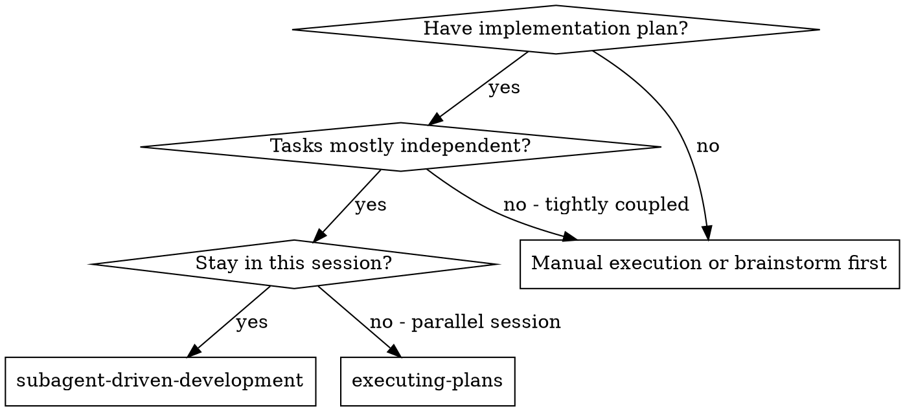
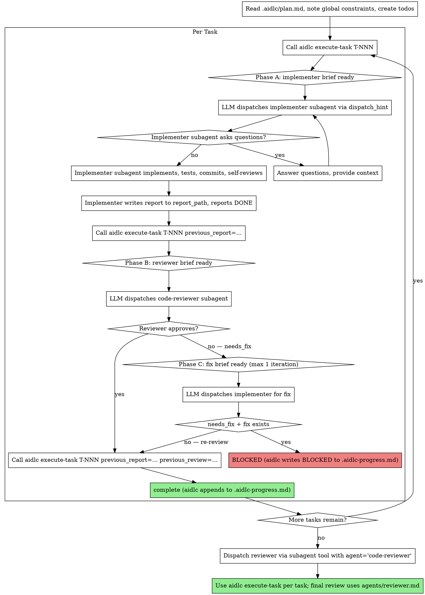

# Subagent-Driven Development

Execute plan by dispatching a fresh implementer subagent per task, a task review (spec compliance + code quality) after each, and a broad whole-branch review at the end.

**Why subagents:** You delegate tasks to specialized agents with isolated context. By precisely crafting their instructions and context, you ensure they stay focused and succeed at their task. They should never inherit your session's context or history — you construct exactly what they need. This also preserves your own context for coordination work.

**Core principle:** Fresh subagent per task + task review (spec + quality) + broad final review = high quality, fast iteration

**Narration:** between tool calls, narrate at most one short line — the
ledger and the tool results carry the record.

**Continuous execution:** Do not pause to check in with your human partner between tasks. Execute all tasks from the plan without stopping. The only reasons to stop are: BLOCKED status you cannot resolve, ambiguity that genuinely prevents progress, or all tasks complete. "Should I continue?" prompts and progress summaries waste their time — they asked you to execute the plan, so execute it.

## When to Use



**vs. Executing Plans (parallel session):**
- Same session (no context switch)
- Fresh subagent per task (no context pollution)
- Review after each task (spec compliance + code quality), broad review at the end
- Faster iteration (no human-in-loop between tasks)

## The Process (adapted to AIDLC's execute-task action)



**Key shift from vanilla superpowers SDD:** instead of generating briefs and review packages locally via helper scripts, the AIDLC `execute-task` action is the single source of truth for task state. It returns `{ phase, dispatch_hint, brief_path, report_path, review_path, fix_brief_path, previous_review }` — the LLM just passes `dispatch_hint` to its subagent tool. The action writes artifacts to `.aidlc/sdd/T-NNN-*.md`, advances the phase machine, and appends to `.aidlc-progress.md` when the task is complete or BLOCKED. No `scripts/task-brief` or `scripts/review-package` are needed — those are subsumed by the action.

## Pre-Flight Plan Review

Before dispatching Task 1, scan the plan once for conflicts:

- tasks that contradict each other or the plan's Global Constraints
- anything the plan explicitly mandates that the review rubric treats as a
  defect (a test that asserts nothing, verbatim duplication of a logic block)

Present everything you find to your human partner as one batched question —
each finding beside the plan text that mandates it, asking which governs —
before execution begins, not one interrupt per discovery mid-plan. If the
scan is clean, proceed without comment. The review loop remains the net for
conflicts that only emerge from implementation.

## Model Selection

Use the least powerful model that can handle each role to conserve cost and increase speed.

**Mechanical implementation tasks** (isolated functions, clear specs, 1-2 files): use a fast, cheap model. Most implementation tasks are mechanical when the plan is well-specified.

**Integration and judgment tasks** (multi-file coordination, pattern matching, debugging): use a standard model.

**Architecture and design tasks**: use the most capable available model.
The final whole-branch review is one of these — dispatch it on the most
capable available model, not the session default.

**Review tasks**: choose the model with the same judgment, scaled to the
diff's size, complexity, and risk. A small mechanical diff does not need the
most capable model; a subtle concurrency change does.

**Always specify the model explicitly when dispatching a subagent.** An
omitted model inherits your session's model — often the most capable and
most expensive — which silently defeats this section.

**Turn count beats token price.** Wall-clock and context cost scale with how
many turns a subagent takes, and the cheapest models routinely take 2-3× the
turns on multi-step work — costing more overall. Use a mid-tier model as the
floor for reviewers and for implementers working from prose descriptions.
When the task's plan text contains the complete code to write, the
implementation is transcription plus testing: use the cheapest tier for
that implementer. Single-file mechanical fixes also take the cheapest tier.

**Task complexity signals (implementation tasks):**
- Touches 1-2 files with a complete spec → cheap model
- Touches multiple files with integration concerns → standard model
- Requires design judgment or broad codebase understanding → most capable model

## Handling Implementer Status

Implementer subagents report one of four statuses. Handle each appropriately:

**DONE:** Re-invoke `aidlc execute-task T-NNN previous_report=<report_path>` (the action uses file-based state in `.aidlc/sdd/`). The action advances to Phase B, writes a reviewer brief at `.aidlc/sdd/T-NNN-reviewer-brief.md`, and returns a `dispatch_hint` with the brief path + review target. Dispatch the task reviewer subagent using that hint — do not generate a separate diff-package script.

**DONE_WITH_CONCERNS:** The implementer completed the work but flagged doubts. Read the concerns before proceeding. If the concerns are about correctness or scope, address them before review. If they're observations (e.g., "this file is getting large"), note them and proceed to review.

**NEEDS_CONTEXT:** The implementer needs information that wasn't provided. Provide the missing context and re-dispatch.

**BLOCKED:** The implementer cannot complete the task. Assess the blocker:
1. If it's a context problem, provide more context and re-dispatch with the same model
2. If the task requires more reasoning, re-dispatch with a more capable model
3. If the task is too large, break it into smaller pieces
4. If the plan itself is wrong, escalate to the human

**Never** ignore an escalation or force the same model to retry without changes. If the implementer said it's stuck, something needs to change.

## Handling Reviewer ⚠️ Items

The task reviewer may report "⚠️ Cannot verify from diff" items — requirements
that live in unchanged code or span tasks. These do not block the rest of the
review, but you must resolve each one yourself before marking the task
complete: you hold the plan and cross-task context the reviewer
lacks. If you confirm an item is a real gap, treat it as a failed spec
review — send it back to the implementer and re-review.

## Constructing Reviewer Prompts

Per-task reviews are task-scoped gates. The broad review happens once, at the
final whole-branch review. When you fill a reviewer template:

- Do not add open-ended directives like "check all uses" or "run race tests
  if useful" without a concrete, task-specific reason
- Do not ask a reviewer to re-run tests the implementer already ran on the
  same code — the implementer's report carries the test evidence
- Do not pre-judge findings for the reviewer — never instruct a reviewer to
  ignore or not flag a specific issue. If you believe a finding would be a
  false positive, let the reviewer raise it and adjudicate it in the review
  loop. If the prompt you are writing contains "do not flag," "don't treat X
  as a defect," "at most Minor," or "the plan chose" — stop: you are
  pre-judging, usually to spare yourself a review loop.
- The global-constraints block you hand the reviewer is its attention
  lens. Copy the binding requirements verbatim from the plan's Global
  Constraints section or the spec: exact values, exact formats, and the
  stated relationships between components ("same layout as X", "matches
  Y"). The reviewer's template already carries the process rules (YAGNI,
  test hygiene, review method) — the constraints block is for what THIS
  project's spec demands.
- Hand the reviewer the implementer's report as the diff evidence. The
  reviewer reads `report_path` (returned by `aidlc execute-task`) plus the
  brief and writes the verdict to `review_path`. AIDLC's `getCommitRangeForTask`
  records the commit range automatically when the task is approved (via
  `git log --grep=<taskId>`); the controller does not record a BASE
  manually, and there is no `HEAD~1` footgun in this model.
- A dispatch prompt describes one task, not the session's history. Do not
  paste accumulated prior-task summaries ("state after Tasks 1-3") into
  later dispatches — a real session's dispatch hit 42k chars of which 99%
  was pasted history. A fresh subagent needs its task, the interfaces it
  touches, and the global constraints. Nothing else.
- Dispatch fix subagents for Critical and Important findings. Record Minor
  findings in the progress ledger as you go, and point the final
  whole-branch review at that list so it can triage which must be fixed
  before merge. A roll-up nobody reads is a silent discard.
- A finding labeled plan-mandated — or any finding that conflicts with
  what the plan's text requires — is the human's decision, like any plan
  contradiction: present the finding and the plan text, ask which governs.
  Do not dismiss the finding because the plan mandates it, and do not
  dispatch a fix that contradicts the plan without asking.
- The final whole-branch review is NOT routed through `aidlc execute-task`
  (it is not a single-task review). Dispatch the reviewer subagent directly
  via the subagent tool with `agent='code-reviewer'` and pass
  `git diff MERGE_BASE..HEAD` (where MERGE_BASE = `git merge-base main HEAD`)
  as the input. The reviewer reads the diff + the plan + the per-task reports
  and writes a verdict to a file the LLM picks (typically
  `.aidlc/sdd/final-review.md`).
- Every fix dispatch carries the implementer contract: the fix subagent
  re-runs the tests covering its change and reports the results. Name the
  covering test files in the dispatch — a one-line fix does not need the
  whole suite. Before re-dispatching the reviewer, confirm the fix report
  contains the covering tests, the command run, and the output; dispatch
  the re-review once all three are present.
- If the final whole-branch review returns findings, dispatch ONE fix
  subagent with the complete findings list — not one fixer per finding.
  Per-finding fixers each rebuild context and re-run suites; a real
  session's final-review fix wave cost more than all its tasks combined.

## File Handoffs

Everything you paste into a dispatch prompt — and everything a subagent
prints back — stays resident in your context for the rest of the session
and is re-read on every later turn. Hand artifacts over as files:

- **Task brief:** before dispatching an implementer, run `aidlc execute-task T-NNN` and read the returned `brief_path`. The action writes the brief to `.aidlc/sdd/T-NNN-brief.md` (containing the full task text from the plan + any frontmatter context) and prints the path. Compose the dispatch so the brief stays the single source of requirements. Your dispatch should contain: (1) one line on where this task fits in the project; (2) the brief path, introduced as "read this first — it is your requirements, with the exact values to use verbatim"; (3) interfaces and decisions from earlier tasks that the brief cannot know; (4) your resolution of any ambiguity you noticed in the brief; (5) the report-file path and report contract. Exact values (numbers, magic strings, signatures, test cases) appear only in the brief.
- **Report file:** the action returns a `report_path` (typically `.aidlc/sdd/T-NNN-report.md`) alongside `brief_path`. Put that report path in the dispatch prompt. The implementer writes the full report there and returns only status, commits, a one-line test summary, and concerns.
- **Reviewer inputs:** the task reviewer gets three paths from the second `aidlc execute-task T-NNN previous_report=<report_path>` call — `brief_path` (the original task brief), `report_path` (the implementer's output), and `review_path` (where the reviewer writes its verdict, typically `.aidlc/sdd/T-NNN-review.md`). All three are printed by the action; the LLM passes them into the reviewer subagent's dispatch.
- **Fix dispatches:** when the review comes back `needs_fix`, re-invoke `aidlc execute-task T-NNN previous_report=<report_path> previous_review=<review_path>`. The action determines that verdict=needs_fix and returns a `fix_brief_path` (typically `.aidlc/sdd/T-NNN-fix-brief.md`) plus a new `report_path` for the fix output. The fixer subagent writes to that report path. After the fix, re-invoke once more with the updated report and the original review to advance to the re-review phase.

The commit range for a task is recovered automatically by `getCommitRangeForTask` (`execute-task.ts`) via `git log --grep=<taskId>` — the controller does not record a BASE manually, and there is no `HEAD~1` truncation footgun in AIDLC's model.

## Durable Progress

Conversation memory does not survive compaction. In real sessions,
controllers that lost their place have re-dispatched entire completed task
sequences — the single most expensive failure observed. Track progress in
a ledger file, not only in todos.

- `aidlc execute-task T-NNN` automatically writes to `.aidlc-progress.md`
  (via F12's progress ledger action — `aidlc append-progress`) when the
  task reaches `phase=complete` or `phase=BLOCKED`. The ledger entry is
  the same `Task N: complete (commits <base7>..<head7>, review clean)`
  format. Do not write to the ledger manually — the action owns it.
- When compacted, re-invoke `aidlc execute-task T-NNN` (no params). The
  action determines the current phase from file existence in `.aidlc/sdd/`
  (brief present but no report → Phase A; report present but no review →
  Phase B; review with verdict=needs_fix → Phase C; complete or BLOCKED
  already recorded → resume at next task) and returns the next dispatch
  hint.
- For tasks already complete or BLOCKED, the action returns
  `phase=complete` or `phase=blocked` and the LLM moves on to the next
  task in the plan.
- The ledger is your recovery map: the commits it names exist in git even
  when your context no longer remembers creating them. After compaction,
  trust the ledger and `git log` over your own recollection.
- `git clean -fdx` will destroy the ledger (it's git-ignored scratch — it
  lives outside `extensions/`, at the worktree root); if that happens,
  recover from `git log`.

## Prompt Templates (AIDLC `dispatch_hint` flow)

AIDLC does not ship local prompt-template files. The `aidlc execute-task`
action generates a `dispatch_hint` for each phase — that hint is the
controller's prompt. The controller passes the hint to the subagent tool
verbatim, with `agent=` set to the role for that phase.

**Implementer dispatch (Phase A or Phase C fix):**
```
Use the subagent tool with agent="implementer" and task="Read the brief
at <brief_path> and follow it. Write your report to <report_path>."
```
The `<brief_path>` is `.aidlc/sdd/T-NNN-brief.md` (Phase A) or
`.aidlc/sdd/T-NNN-fix-brief.md` (Phase C fix). The report path is
`.aidlc/sdd/T-NNN-report.md` (Phase A) or `.aidlc/sdd/T-NNN-fix-report.md`
(Phase C). The `dispatch_hint` returned by `aidlc execute-task` contains
the exact strings — do not reconstruct them by hand.

**Reviewer dispatch (Phase B or final whole-branch review):**
```
Use the subagent tool with agent="code-reviewer" and task="Read the
reviewer brief at <reviewer_brief_path> and write your verdict to
<review_path>."
```
The reviewer reads the brief + the implementer's report + the diff via the
paths in the brief and writes the verdict file starting with `## Verdict`
heading (`approved` | `needs_fix` | `blocked`).

**Final whole-branch review:** dispatch directly (NOT through
`aidlc execute-task`) with `agent='code-reviewer'` and pass
`git diff MERGE_BASE..HEAD` as the input. The reviewer reads the diff +
the plan + the per-task reports in `.aidlc/sdd/` and writes a verdict.

**Implementer / reviewer agents:** the agent definitions live in
`extensions/aidlc-workflow/agents/implementer.md` and
`extensions/aidlc-workflow/agents/reviewer.md`. Both agents load
companion skills (`implement`, `test-driven-development`,
`verification-before-completion`, `systematic-debugging`,
`review`) — these are referenced from the agents' `description` frontmatter
and the dispatch hint should not duplicate them.

## Example Workflow

```
You: I'm using Subagent-Driven Development to execute this plan.

[Read plan file once: .aidlc/plan.md]
[Create todos for all tasks]

Task 1: Hook installation script

[Call aidlc execute-task T-001 → returns dispatch_hint with brief_path=.aidlc/sdd/T-001-brief.md]
[Dispatch implementer subagent with the dispatch_hint]

Implementer: "Before I begin - should the hook be installed at user or system level?"

You: "User level (~/.config/superpowers/hooks/)"

Implementer: "Got it. Implementing now..."
[Later] Implementer:
  - Implemented install-hook command
  - Added tests, 5/5 passing
  - Self-review: Found I missed --force flag, added it
  - Committed

[Call aidlc execute-task T-001 previous_report=... → returns dispatch_hint for reviewer]
[Dispatch reviewer subagent with the dispatch_hint]
Task reviewer (writes to .aidlc/sdd/T-001-review.md):
  - ## Verdict
    approved
  - Spec ✅ - all requirements met, nothing extra.
  - Strengths: Good test coverage, clean. Issues: None. Task quality: Approved.

[Call aidlc execute-task T-001 previous_report=... previous_review=... → phase=complete]
[aidlc appends to .aidlc-progress.md: T-001 complete (commits ..hash.., review clean)]

Task 2: Recovery modes

[Call aidlc execute-task T-002 → dispatch implementer]

Implementer: [No questions, proceeds]
Implementer:
  - Added verify/repair modes
  - 8/8 tests passing
  - Self-review: All good
  - Committed

[Call aidlc execute-task T-002 previous_report=... → dispatch reviewer]
Task reviewer (writes to .aidlc/sdd/T-002-review.md):
  - ## Verdict
    needs_fix
  - Spec ❌:
    - Missing: Progress reporting (spec says "report every 100 items")
    - Extra: Added --json flag (not requested)
  - Issues (Important): Magic number (100)

[Call aidlc execute-task T-002 previous_report=... previous_review=...
 → phase=fix, dispatch_hint has fix_brief_path]
[Dispatch implementer for fix with all findings]

Fixer: Removed --json flag, added progress reporting, extracted PROGRESS_INTERVAL constant

[Task reviewer reviews again]
Task reviewer: ## Verdict approved. Task quality: Approved.

[Call aidlc execute-task T-002 previous_report=... previous_review=... → phase=complete]

...

[After all tasks]
[Dispatch reviewer with agent='code-reviewer' and git diff MERGE_BASE..HEAD as input]
Final reviewer: All requirements met, ready to merge

[Use aidlc:ship]
Done!
```

## Advantages

**vs. Manual execution:**
- Subagents follow TDD naturally
- Fresh context per task (no confusion)
- Parallel-safe (subagents don't interfere)
- Subagent can ask questions (before AND during work)

**vs. Executing Plans:**
- Same session (no handoff)
- Continuous progress (no waiting)
- Review checkpoints automatic

**Efficiency gains:**
- Controller curates exactly what context is needed; bulk artifacts move
  as files, not pasted text
- Subagent gets complete information upfront
- Questions surfaced before work begins (not after)

**Quality gates:**
- Self-review catches issues before handoff
- Task review carries two verdicts: spec compliance and code quality
- Review loops ensure fixes actually work
- Spec compliance prevents over/under-building
- Code quality ensures implementation is well-built

**Cost:**
- More subagent invocations (implementer + reviewer per task)
- Controller does more prep work (extracting all tasks upfront)
- Review loops add iterations
- But catches issues early (cheaper than debugging later)

## Red Flags

**Never:**
- Start implementation on main/master branch without explicit user consent
- Skip task review, or accept a report missing either verdict (spec compliance AND task quality are both required)
- Proceed with unfixed issues
- Dispatch multiple implementation subagents in parallel (conflicts)
- Make a subagent read the whole plan file (hand it its task brief from
  `.aidlc/sdd/T-NNN-brief.md` instead — the brief is the single source of requirements)
- Skip scene-setting context (subagent needs to understand where task fits)
- Ignore subagent questions (answer before letting them proceed)
- Accept "close enough" on spec compliance (reviewer found spec issues = not done)
- Skip review loops (reviewer found issues = implementer fixes = review again)
- Let implementer self-review replace actual review (both are needed)
- Tell a reviewer what not to flag, or pre-rate a finding's severity in the
  dispatch prompt ("treat it as Minor at most") — the plan's example code is
  a starting point, not evidence that its weaknesses were chosen
- Dispatch a task reviewer without an implementer report — the action needs
  the report on disk (or as `previous_report`) to write the reviewer brief
- Move to next task while the review has open Critical/Important issues
- Re-dispatch a task the progress ledger already marks complete — check
  the ledger (and `git log`) after any compaction or resume

**If subagent asks questions:**
- Answer clearly and completely
- Provide additional context if needed
- Don't rush them into implementation

**If reviewer finds issues:**
- Implementer (same subagent) fixes them
- Reviewer reviews again
- Repeat until approved
- Don't skip the re-review

**If subagent fails task:**
- Dispatch fix subagent with specific instructions
- Don't try to fix manually (context pollution)

## Integration

**Required workflow skills (AIDLC equivalents):**
- **aidlc-workflow** (`extensions/aidlc-workflow/skills/aidlc-workflow/SKILL.md`) — orchestrator; the slash commands that drive each phase (`/specify`, `/plan`, `/implement`, `/test`, `/review`, `/ship`)
- **plan** (`extensions/aidlc-workflow/skills/plan/SKILL.md`) — produces `.aidlc/plan.md` that this skill executes
- **implement** (`extensions/aidlc-workflow/skills/implement/SKILL.md`) — the per-task workflow each implementer subagent follows
- **review** (`extensions/aidlc-workflow/skills/review/SKILL.md`) — the five-axis review rubric used by the final whole-branch review
- **ship** (`extensions/aidlc-workflow/skills/ship/SKILL.md`) — final integration step after all tasks are complete (replaces `superpowers:finishing-a-development-branch`)
- **worktree-aware orchestration** (`extensions/aidlc-workflow/worktree.ts`) — AIDLC's git-worktree model; tier-4 spec/plan is worktree-aware

**Subagents should use (AIDLC skills, loaded by agent definitions):**
- **test-driven-development** (`extensions/aidlc-workflow/skills/test-driven-development/SKILL.md`) — TDD discipline (replaces `superpowers:test-driven-development`)
- **verification-before-completion** (`extensions/aidlc-workflow/skills/verification-before-completion/SKILL.md`) — gates all completion claims
- **systematic-debugging** (`extensions/aidlc-workflow/skills/systematic-debugging/SKILL.md`) — invoked before any fix when a bug is found
- **implementer agent** (`extensions/aidlc-workflow/agents/implementer.md`) — the implementer subagent definition
- **reviewer agent** (`extensions/aidlc-workflow/agents/reviewer.md`) — the reviewer subagent definition

**Optional / cross-model skills (may also be installed):**
- **receiving-code-review** (`extensions/aidlc-workflow/skills/receiving-code-review/SKILL.md`) — for responding to PR review feedback after the branch review
- **executing-plans** (superpowers skill, parallel session variant) — use this skill instead when the work needs a parallel session rather than same-session execution

## AIDLC-Specific Notes

- Use the `aidlc execute-task T-NNN` action to start each task cycle. Do not generate briefs or review packages locally — the action owns that.
- The action returns `{ phase, dispatch_hint, brief_path, report_path, review_path, fix_brief_path, ... }`. Pass `dispatch_hint` directly to the `subagent` tool — the hint is the full dispatch recipe for the current phase.
- Artifacts live at `.aidlc/sdd/T-NNN-{brief,report,review,fix-brief,fix-report}.md`. These paths are returned by the action, never hardcoded in dispatch prompts.
- After approval (verdict=approved), the action updates `.aidlc-progress.md` automatically via F12's progress ledger (`aidlc append-progress`). After BLOCKED, the same action writes the BLOCKED line with reason. Do not write to the ledger manually.
- Max 1 fix iteration per task. After that, the next `needs_fix` verdict transitions the action to `phase=BLOCKED` instead of returning another `fix_brief_path`. The reviewer-subagent dispatch is then re-invoked, not the implementer.
- The action is stateful: pass `previous_report` and `previous_review` to advance phases. To re-check status after compaction, invoke with no params — the action infers the current phase from `.aidlc/sdd/` file existence.
- Review file format contract: the reviewer's verdict file MUST begin with a `## Verdict` heading whose first non-whitespace content is one of `approved`, `needs_fix`, or `blocked`. The action parses this heading to decide which phase to return next.
- When the action returns `phase=blocked`, the LLM dispatches the reviewer subagent (not the implementer) to triage; BLOCKED is a human-handoff signal, not an automatic retry.
- The action is the only allowed writer to `.aidlc-progress.md`. Manual edits are tolerated only for ad-hoc annotations; the action overwrites them on the next phase transition.
